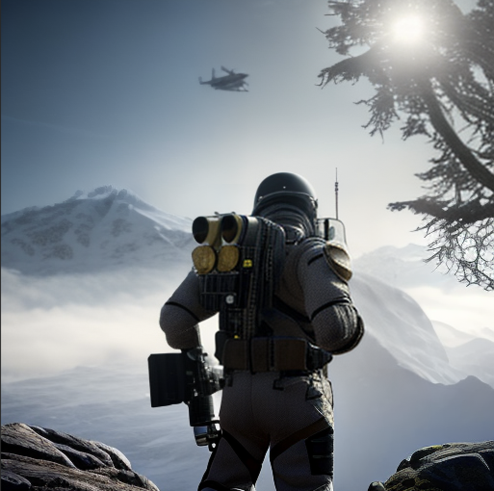

## Hi 👋! My name is Saai Sudarsanan

I am a Cloud Engineer and I have only one skill, the skill to learn things quickly. I dabble in a lot of things, while mostly concentrating in `Cloud Computing`, I also have a good amount of knowledge in `Distributed Systems`, `Cybersecurity`,`Economics, Markets and Game Theory`,etc. 

  
  
  
  
  
  
  
  
  
  
  
  
  
  
  
  
  

###

  
  
  <a href="https://saaisudarsanan.medium.com/" target="_blank">
    

###

 

###

# 🏆 Achievements & Engineering Highlights

Welcome to a collection of some of my most impactful contributions — from Kubernetes migrations to building observability and improving system reliability at scale.

---

## 🚀 Kubernetes Migration & Infrastructure Modernization

- Migrated core Clojure services to Kubernetes (DEV & PROD).
- Developed reusable Helm charts for scalable and maintainable deployments.
- Collaborated across teams to ensure zero-downtime rollouts and seamless infrastructure adoption.
- Conducted knowledge transfer sessions to onboard devs to the Kubernetes ecosystem.

---

## 📈 Observability & Monitoring Enhancements

- Integrated distributed tracing using **Jaeger** and **OpenTelemetry** for performance visibility across microservices.
- Set up centralized logging with **Fluent Bit** and **OpenSearch**, improving system debugging and monitoring.
- Implemented ISM policies and disk alerts to optimize resource usage and maintain cluster health.

---

## ⚙️ Operational Excellence

- Automated deployment pipelines using **Jenkins** and **Helm**, reducing build + deploy times by up to **75%**.
- Solved critical PROD issues, from scaling bottlenecks to log ingestion failures and service restarts.
- Migrated workloads to **Spot Instances**, and introduced **Pod Disruption Budgets (PDBs)** for high availability.

---

## 📚 Documentation & Developer Enablement

- Authored detailed guides on Kubernetes migration, Helm chart best practices, and Terraform-based provisioning.
- Led internal workshops on tools like **ArgoCD**, **Grafana**, and **Jenkins** to increase team self-sufficiency.
- Promoted a culture of knowledge sharing and blameless retrospectives.

---

## 💡 Featured Projects

- [**Behold**](https://github.com/0xhunterkiller/behold) – A test observability tool for Kubernetes deployments.
- [**Rook**](https://github.com/0xhunterkiller/rook) – Directory Integrity Monitoring with real-time alerts.
- [**Keylogger (Ethical POC)**](https://github.com/0xhunterkiller/keylogger) – Malware research demo (ethical hacking).

---

## 📌 TL;DR

- 🧠 Infra you can trust.  
- 📊 Observability that helps.  
- 🔐 Security that’s not an afterthought.  
- ⚡ CI/CD that doesn’t waste your time.  
- 💬 Docs and tooling that empower engineers.

---

📬 Feel free to connect:  
[LinkedIn](https://www.linkedin.com/in/0xhunterkiller/) • [GitHub](https://github.com/0xhunterkiller) • [Email](mailto:connectwithsaai@gmail.com)
